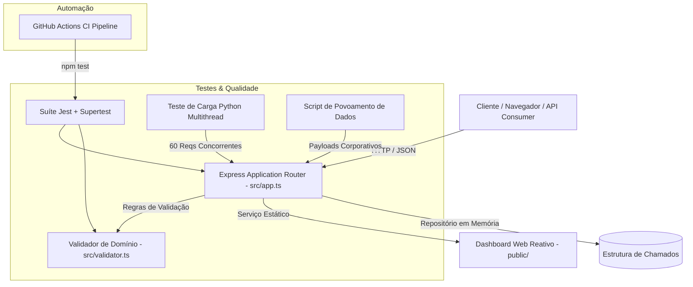
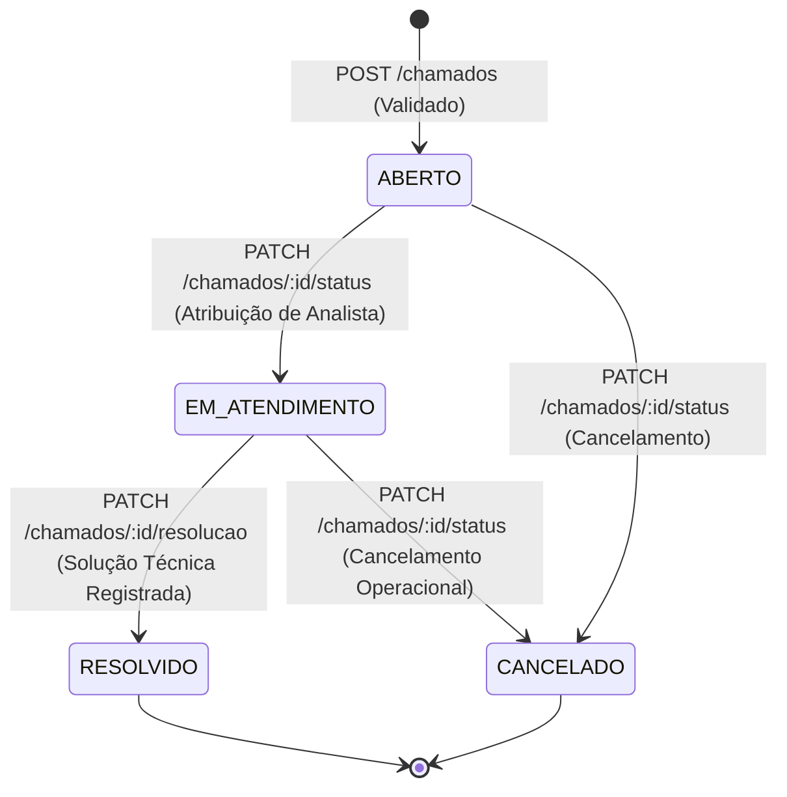
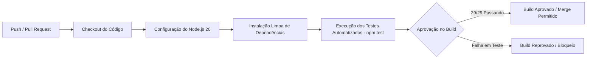

# TicketFlow - Plataforma de Service Desk & Gestão de Incidentes

<div align="center">


<p align="center">
  <strong>Sistema corporativo de Service Desk e Gestão de Incidentes de TI, desenvolvido com arquitetura orientada a serviços RESTful, validações estritas de regras de negócio, interface web reativa com alternância de papéis (Solicitante vs Suporte), suíte completa de testes automatizados e esteira de CI/CD.</strong>
</p>

[Visão Geral](#-visão-geral) •
[Arquitetura](#-arquitetura-e-design) •
[Fluxo de Atendimento](#-ciclo-de-vida-do-chamado) •
[Documentação da API](#-documentação-da-api-restful) •
[Dashboard Web](#-painel-operacional-dashboard) •
[Instalação & Execução](#-instalação-e-execução) •
[Qualidade & Testes](#-qualidade-e-testes-automatizados) •
[CI/CD](#-esteira-de-integração-contínua-cicd)

---

</div>

## 📌 Visão Geral

O **TicketFlow** é uma solução empresarial concebida para centralizar, estruturar e rastrear o ciclo de vida completo de requisições de serviço e incidentes de Tecnologia da Informação. Alinhado às boas práticas de **ITIL / ITSM (IT Service Management)**, o sistema garante:

- **Padronização na Entrada de Demandas**: Validação formal de títulos e especificações técnicas de incidentes.
- **Transparência Operacional**: Rastreamento de autoria, atribuição de técnicos analistas e carimbos de data/hora (*timestamps*) em todas as mutações.
- **Workflow Estruturado**: Transição auditável entre os estados `ABERTO`, `EM_ATENDIMENTO`, `RESOLVIDO` e `CANCELADO`.
- **Resolução Técnica Obrigatória**: Exigência de detalhamento da causa raiz e solução adotada antes do encerramento do incidente.
- **Resiliência e Performance**: Suporte comprovado a alta concorrência por testes de estresse e carga multithread.

---

## 🏛 Arquitetura e Design

A aplicação segue princípios de **Separation of Concerns (SoC)** e arquitetura limpa em camadas, isolando roteamento HTTP, validações de domínio e serviços auxiliares:



### Tecnologias Utilizadas

| Camada | Tecnologia | Propósito |
| :--- | :--- | :--- |
| **Linguagem Base** | TypeScript 5.9 | Tipagem estática rigorosa, interfaces de domínio e menor propensão a bugs em runtime |
| **Runtime & Servidor** | Node.js 20 LTS + Express 5.2 | Servidor HTTP de alta performance e suporte nativo a middleware e rotas assíncronas |
| **Interface / Dashboard** | HTML5 Semântico, CSS3 Moderno, JavaScript ES6+ | SPA reativa com design tokens, tipografia Plus Jakarta Sans e suporte multi-perfil |
| **Suíte de Testes** | Jest 30.5 + Supertest 7.2 + ts-jest | Testes unitários de validação e testes de integração end-to-end de rotas HTTP |
| **Testes de Estresse & Seed** | Python 3 (urllib, concurrent.futures) | Disparos concorrentes multithread, medição de latência e povoamento com cenários reais |
| **Pipeline de CI/CD** | GitHub Actions | Validação contínua automática a cada `push` e `pull request` |

---

## 🔄 Ciclo de Vida do Chamado

O ciclo de vida de um incidente segue uma máquina de estados finita bem definida:



### Regras de Negócio Corporativas

1. **Validação Estrita de Título**:
   - Mínimo de **5 caracteres** (após remoção de espaços em branco nas extremidades).
   - Máximo de **100 caracteres**.
   - Chamados fora deste limite são sumariamente rejeitados com `HTTP 400 Bad Request`.
2. **Atendimento Vinculado**:
   - A transição para `EM_ATENDIMENTO` permite registrar o nome do analista ou equipe de suporte responsável.
3. **Resolução Técnica Auditável**:
   - A finalização do incidente exige a descrição detalhada da solução (`resolucao`), garantindo a base de conhecimento de TI.

---

## 📡 Documentação da API RESTful

A API expõe endpoints padronizados no padrão REST, utilizando os verbos HTTP correspondentes e códigos de status semânticos.

### Resumo das Rotas

| Método | Endpoint | Descrição | Status Sucesso | Status Erro |
| :---: | :--- | :--- | :---: | :---: |
| `GET` | `/` | Health check e verificação da rota raiz | `200 OK` | - |
| `GET` | `/chamados` | Lista todos os chamados registrados | `200 OK` | - |
| `GET` | `/chamados/:id` | Obtém detalhes específicos de um chamado | `200 OK` | `404 Not Found` |
| `POST` | `/chamados` | Cadastra um novo chamado no sistema | `201 Created` | `400 Bad Request` |
| `PATCH` | `/chamados/:id/status` | Atualiza o status e/ou responsável técnico | `200 OK` | `400 / 404` |
| `PATCH` | `/chamados/:id/resolucao`| Finaliza o chamado com parecer técnico | `200 OK` | `400 / 404` |
| `DELETE`| `/chamados/:id` | Exclui permanentemente um chamado | `200 OK` | `404 Not Found` |
| `GET` | `/dashboard` | Painel visual interativo do Service Desk | `200 OK` | - |

---

### Detalhamento dos Endpoints

#### 1. Verificação da Rota Raiz
```http
GET / HTTP/1.1
Host: localhost:3000
```
- **Resposta (200 OK)**:
```text
Chegou na rota raiz
```

---

#### 2. Listar Todos os Chamados
```http
GET /chamados HTTP/1.1
Host: localhost:3000
Accept: application/json
```
- **Resposta (200 OK)**:
```json
[
  {
    "id": 1,
    "titulo": "Falha na conexão VPN corporativa",
    "descricao": "Usuários do financeiro sem acesso após atualização.",
    "status": "ABERTO",
    "dataCriacao": "2026-09-23T19:40:00.000Z"
  }
]
```

---

#### 3. Obter Chamado por ID
```http
GET /chamados/1 HTTP/1.1
Host: localhost:3000
Accept: application/json
```
- **Resposta Sucesso (200 OK)**:
```json
{
  "id": 1,
  "titulo": "Falha na conexão VPN corporativa",
  "descricao": "Usuários do financeiro sem acesso após atualização.",
  "status": "ABERTO",
  "dataCriacao": "2026-09-23T19:40:00.000Z"
}
```
- **Resposta Erro (404 Not Found)**:
```json
{
  "erro": "Chamado não encontrado."
}
```

---

#### 4. Criar Chamado
```http
POST /chamados HTTP/1.1
Host: localhost:3000
Content-Type: application/json

{
  "titulo": "Lentidão nas consultas ao banco de dados",
  "descricao": "Queries da tabela de pedidos excedendo timeout de 15s."
}
```
- **Resposta Sucesso (201 Created)**:
```json
{
  "mensagem": "Chamado criado com sucesso",
  "chamado": {
    "id": 2,
    "titulo": "Lentidão nas consultas ao banco de dados",
    "descricao": "Queries da tabela de pedidos excedendo timeout de 15s.",
    "status": "ABERTO",
    "dataCriacao": "2026-09-23T19:42:15.120Z"
  }
}
```
- **Resposta Erro de Validação (400 Bad Request)**:
```json
{
  "erro": "Título inválido. O título deve possuir entre 5 e 100 caracteres."
}
```

---

#### 5. Atualizar Status do Chamado (Workflow)
```http
PATCH /chamados/2/status HTTP/1.1
Host: localhost:3000
Content-Type: application/json

{
  "status": "EM_ATENDIMENTO",
  "responsavel": "Carlos Silva - DBA N2"
}
```
- **Resposta Sucesso (200 OK)**:
```json
{
  "mensagem": "Status atualizado com sucesso",
  "chamado": {
    "id": 2,
    "titulo": "Lentidão nas consultas ao banco de dados",
    "descricao": "Queries da tabela de pedidos excedendo timeout de 15s.",
    "status": "EM_ATENDIMENTO",
    "responsavel": "Carlos Silva - DBA N2",
    "dataCriacao": "2026-09-23T19:42:15.120Z",
    "dataAtualizacao": "2026-09-23T19:45:00.340Z"
  }
}
```

---

#### 6. Registrar Solução Técnica e Encerrar
```http
PATCH /chamados/2/resolucao HTTP/1.1
Host: localhost:3000
Content-Type: application/json

{
  "resolucao": "Adicionado índice composto na coluna data_criacao e recompiladas as estatísticas da tabela.",
  "responsavel": "Carlos Silva - DBA N2"
}
```
- **Resposta Sucesso (200 OK)**:
```json
{
  "mensagem": "Chamado resolvido com sucesso",
  "chamado": {
    "id": 2,
    "titulo": "Lentidão nas consultas ao banco de dados",
    "descricao": "Queries da tabela de pedidos excedendo timeout de 15s.",
    "status": "RESOLVIDO",
    "responsavel": "Carlos Silva - DBA N2",
    "resolucao": "Adicionado índice composto na coluna data_criacao e recompiladas as estatísticas da tabela.",
    "dataCriacao": "2026-09-23T19:42:15.120Z",
    "dataAtualizacao": "2026-09-23T19:50:11.890Z"
  }
}
```

---

#### 7. Excluir Chamado
```http
DELETE /chamados/2 HTTP/1.1
Host: localhost:3000
```
- **Resposta Sucesso (200 OK)**:
```json
{
  "mensagem": "Chamado excluído com sucesso"
}
```

---

## 💻 Painel Operacional (Dashboard)

A aplicação conta com uma interface Single-Page Application (SPA) reativa disponível em `/dashboard`:

### Recursos do Dashboard
- **Alternância de Perfis de Usuário**:
  - **Perfil Solicitante**: Foco na experiência do colaborador com formulário guiado, barra de progresso visual em tempo real (indicando a faixa de 5 a 100 caracteres) e consulta de chamados próprios.
  - **Perfil Equipe de Suporte**: Visão analítica para atendimento de fila, com botões de ação rápida para assumir chamado (`EM_ATENDIMENTO`), modal dedicado para encerramento com parecer técnico (`RESOLVIDO`) e cancelamento.
- **Painel de Métricas em Tempo Real**: Contadores instantâneos de total de chamados, abertos, em atendimento e resolvidos.
- **Filtros e Busca Textual**: Pesquisa instantânea por ID, título, responsável ou texto da descrição, além de abas de filtragem por status.
- **Feedback Visual (Toast Notifications)**: Notificações em toast flutuante para todas as operações da API.

---

## 🚀 Instalação e Execução

### Pré-requisitos
- **Node.js**: Versão `20.x` LTS (ou versão `>= 18.0.0`)
- **npm**: Versão `9.x` ou superior
- **Python**: Versão `3.8+` *(apenas para execução dos scripts de teste de carga e seed)*

### Passo a Passo

1. **Clone o repositório:**
   ```bash
   git clone https://github.com/wallace-2105/TicketFlow.git
   cd TicketFlow
   ```

2. **Instale as dependências do projeto:**
   ```bash
   npm install
   ```

3. **Inicie o servidor em modo de desenvolvimento:**
   ```bash
   npm run dev
   ```
   > O servidor iniciará em `http://localhost:3000`.

4. **Acesse as interfaces e rotas:**
   - **Dashboard Web**: [http://localhost:3000/dashboard](http://localhost:3000/dashboard)
   - **Endpoint Base**: [http://localhost:3000/](http://localhost:3000/)
   - **API de Chamados**: [http://localhost:3000/chamados](http://localhost:3000/chamados)

5. **Compilação para Produção:**
   ```bash
   npm run build
   npm start
   ```

---

## 🧪 Qualidade e Testes Automatizados

A estabilidade e a corretude do sistema são asseguradas por uma pirâmide de testes rigorosa com **100% de aprovação (29 testes executados e aprovados)**:

### 1. Testes Unitários e de Integração (Jest + Supertest)
```bash
npm test
```

A suíte cobre exaustivamente:
- **Regras de Validação de Título (`src/validator.test.ts`)**:
  - Rejeição de valores vazios ou compostos exclusivamente por espaços.
  - Rejeição de títulos com menos de 5 caracteres e exatamente 4 caracteres.
  - Rejeição de títulos com mais de 100 caracteres.
  - Aceitação nos limites exatos (5 e 100 caracteres) e valores intermediários.
  - Comportamento de higienização de strings (`trim`).
- **Testes de Integração de Rotas HTTP (`src/app.test.ts`)**:
  - `GET /`: Validação de status 200 e payload textual de resposta.
  - `POST /chamados`: Criação com sucesso, payloads mínimos, rejeição de payloads inválidos.
  - `GET /chamados`: Listagem inicial vazia e com múltiplos registros.
  - `GET /chamados/:id`: Recuperação de chamado e tratamento de `404 Not Found`.
  - `PATCH /chamados/:id/status`: Transições de status e validação de domínio.
  - `PATCH /chamados/:id/resolucao`: Validação de obrigatoriedade da resolução técnica.
  - `DELETE /chamados/:id`: Exclusão de registro e verificação de não existência subsequente.

---

### 2. Povoamento de Dados para Demonstração (Seed)
Popule a API com incidentes corporativos realistas (VPN, banco de dados, Kubernetes, certificados SSL):
```bash
npm run seed
```

---

### 3. Teste de Carga e Estresse Multithread
Avalie a resiliência e a latência da API sob concorrência real:
```bash
npm run test:load
```
- **Concorrência**: 10 threads de trabalho simultâneas (`concurrent.futures`).
- **Volume**: 60 requisições concorrentes alternando payloads válidos e inválidos.
- **Relatório Emitido**: Throughput médio (RPS), latência mínima, média, mediana e desvio padrão.

---

## ⚙️ Esteira de Integração Contínua (CI/CD)

O projeto possui integração contínua configurada via **GitHub Actions** ([`.github/workflows/ci.yml`](.github/workflows/ci.yml)), garantindo que todo código enviado para as branches `main` ou `master` mantenha os padrões de qualidade estabelecidos.

### Fluxo do Pipeline:


---

## 📁 Estrutura de Diretórios

```plaintext
tasiii-lib/
├── .github/
│   └── workflows/
│       └── ci.yml               # Pipeline de Integração Contínua (GitHub Actions)
├── public/                      # Camada Frontend / Painel Web Interativo
│   ├── css/
│   │   └── style.css            # Folha de estilos corporativa com Design System
│   ├── js/
│   │   └── app.js               # Lógica da SPA com suporte multi-perfil
│   └── index.html               # Estrutura semântica do Dashboard TicketFlow
├── scripts/                     # Utilitários de Teste e Infraestrutura
│   ├── load_test.py             # Script de teste de estresse e concorrência multithread
│   └── seed_tickets.py          # Script de povoamento com dados realistas de TI
├── src/                         # Código-Fonte do Backend (TypeScript)
│   ├── app.ts                   # Rotas Express, regras REST e controle de estado
│   ├── app.test.ts              # Suíte de testes de integração com Supertest
│   ├── server.ts                # Ponto de entrada e inicialização do servidor HTTP
│   ├── validator.ts             # Função de validação de regras de negócio (Título)
│   └── validator.test.ts        # Testes unitários para regras de validação
├── jest.config.ts               # Configuração do executor de testes Jest
├── package.json                 # Metadados, dependências e scripts do projeto
├── tsconfig.json                # Configurações do compilador TypeScript
└── README.md                    # Documentação técnica oficial do projeto
```

---

## 📄 Scripts Disponíveis no `package.json`

| Comando | Descrição |
| :--- | :--- |
| `npm run dev` | Inicia o servidor em modo de desenvolvimento com `ts-node` |
| `npm start` | Executa o servidor de desenvolvimento |
| `npm run build` | Compila o código TypeScript para JavaScript na pasta `dist/` |
| `npm test` | Executa a suíte de testes unitários e de integração com Jest em modo `--verbose` |
| `npm run seed` | Dispara o script Python de povoamento de chamados corporativos |
| `npm run test:load` | Dispara o teste de estresse multithread e gera o relatório estatístico |

---

## 👥 Contribuição e Padrões de Desenvolvimento

Para contribuir com o projeto:

1. Crie uma branch para sua funcionalidade ou correção:
   ```bash
   git checkout -b feature/minha-melhoria
   ```
2. Mantenha os padrões semânticos de commit:
   - `feat:` para novas funcionalidades.
   - `fix:` para correção de bugs.
   - `test:` para adição ou alteração de testes.
   - `docs:` para atualizações na documentação.
3. Certifique-se de que todos os 29 testes continuam passando:
   ```bash
   npm test
   ```
4. Submeta seu Pull Request para avaliação.

---

## 📜 Licença

Este projeto está licenciado sob a licença [ISC](LICENSE).
Desenvolvido como solução corporativa para gestão de incidentes e service desk.
